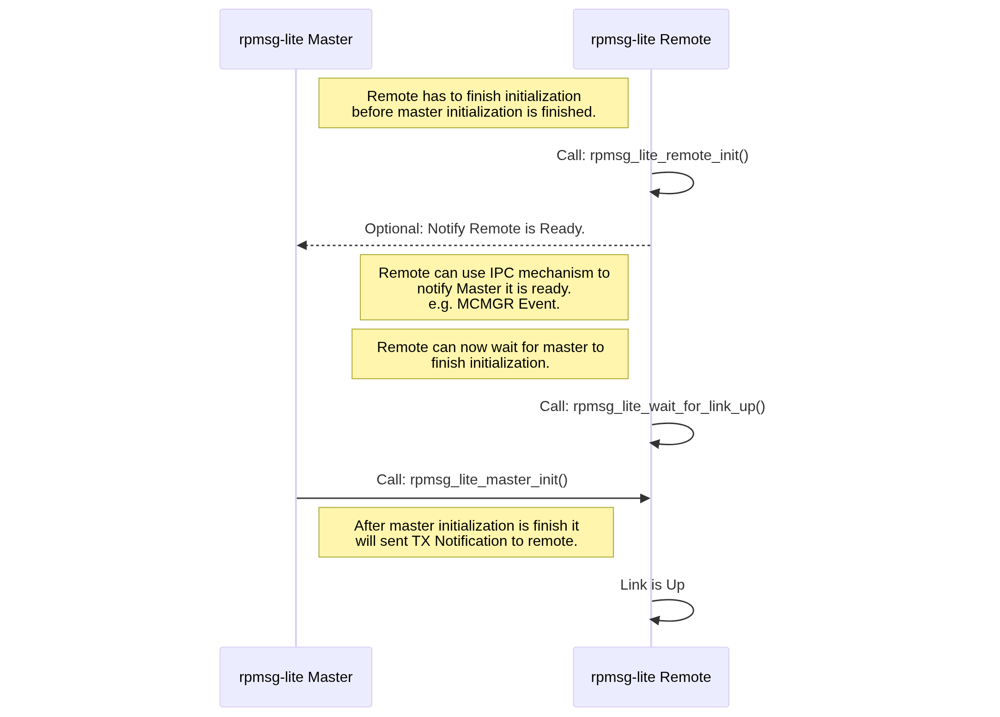
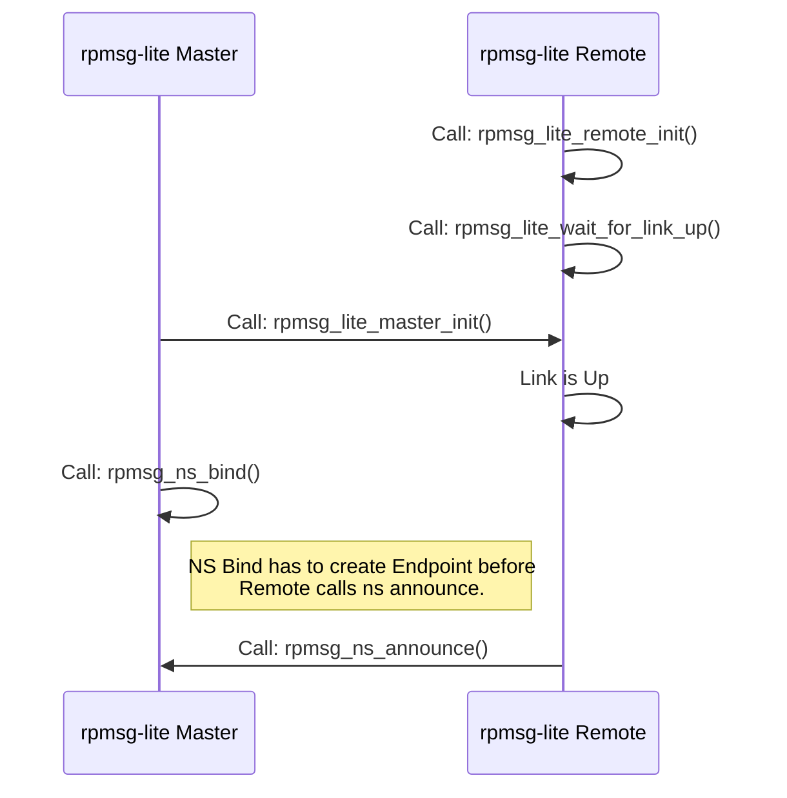
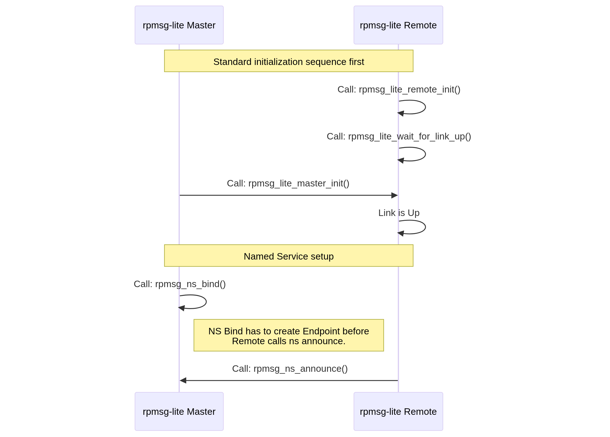
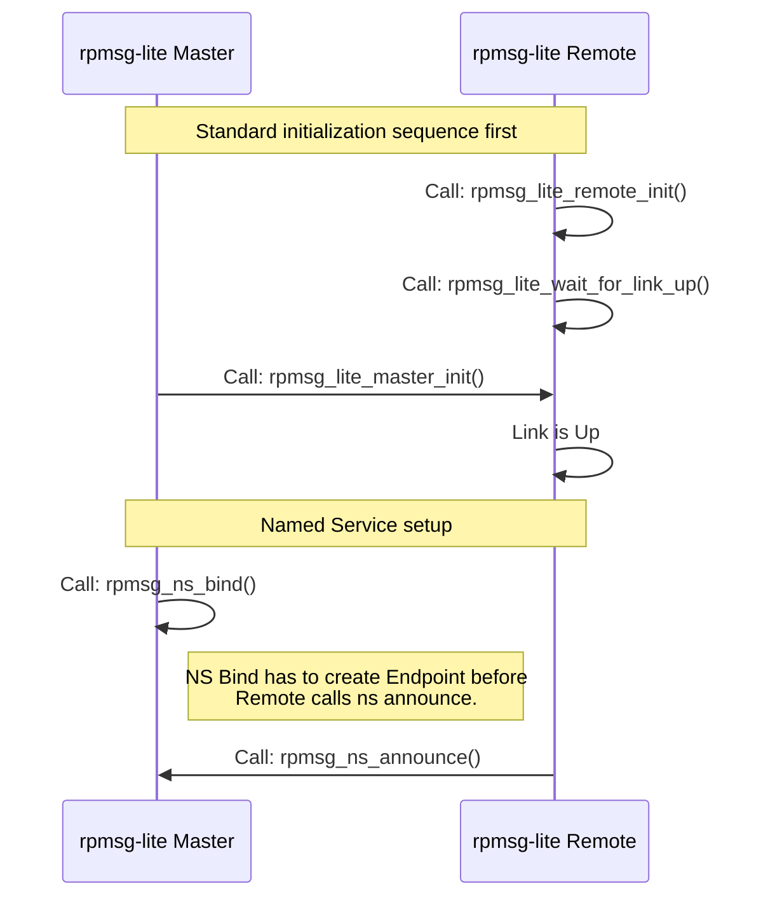
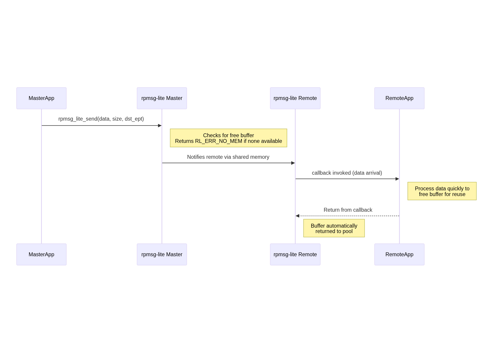
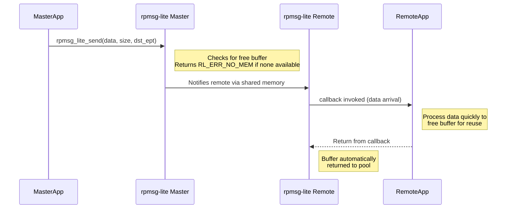
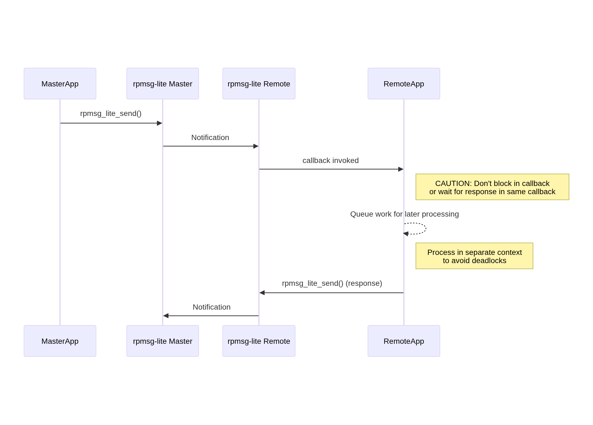
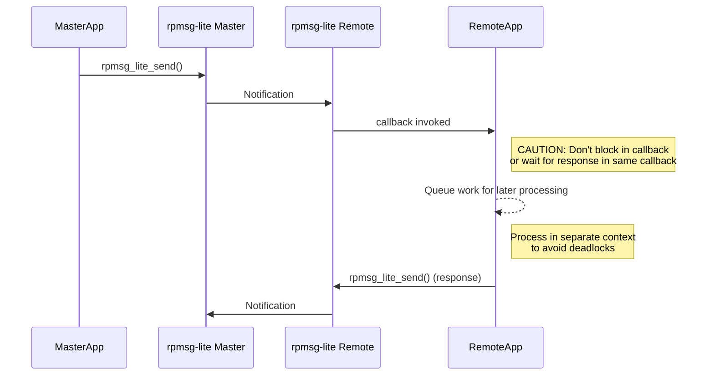

# RPMSG-Lite Design Considerations

This document outlines important design considerations when integrating the RPMSG-Lite middleware into your multicore application. Following these guidelines will help you avoid common pitfalls and ensure reliable inter-processor communication.

## Table of Contents

- [RPMSG-Lite Design Considerations](#rpmsg-lite-design-considerations)
  - [Table of Contents](#table-of-contents)
  - [1. Initialization Sequence](#1-initialization-sequence)
  - [2. Named Service (NS) Endpoint Handling](#2-named-service-ns-endpoint-handling)
  - [3. Buffer Management](#3-buffer-management)
  - [4. Callback Handling](#4-callback-handling)
  - [5. Shutdown Considerations](#5-shutdown-considerations)
  - [6. Thread Safety](#6-thread-safety)

## 1. Initialization Sequence

The order of initialization between master and remote processors is critical:



<details>
<summary>Mermaid source (click to expand)</summary>


</details>


**Key considerations:**

- The remote processor **must** initialize its RPMSG-Lite instance and set up interrupt handlers **before** the master initializes.
- If the remote is not ready to receive the initial notification from the master, it may get stuck in an infinite loop waiting for a connection.
- The master is responsible for setting up the shared memory and VirtIO rings.
- Both sides must use compatible configuration parameters (buffer sizes, counts, etc.).
- **Application-level synchronization** between cores is recommended:
  - A IPC mechanism like MCMGR (Multicore Manager) should be used to signal when the remote core is ready
  - The master core should wait for this signal before initializing its RPMSG-Lite instance
  - Example code pattern:
    ```c
    /* On master core */
    /* Register for remote core ready event */
    MCMGR_RegisterEvent(kMCMGR_RemoteApplicationEvent, eventHandler, &readyEventData);

    /* Wait until remote core signals it's ready */
    while (APP_RPMSG_READY_EVENT_DATA != readyEventData) {};

    /* Now safe to initialize RPMSG-Lite master */
    my_rpmsg = rpmsg_lite_master_init(...);
    ```

## 2. Named Service (NS) Endpoint Handling

When using Named Services for dynamic endpoint discovery:



<details>
<summary>Mermaid source (click to expand)</summary>


</details>

**Key considerations:**

- **Initialization order matters**: Complete the standard RPMSG-Lite initialization sequence before setting up Named Services.
- **Master must bind first**: Call `rpmsg_ns_bind()` on the master before the remote calls `rpmsg_ns_announce()`.
- **Service discovery flow**:
  1. Master registers for NS announcements using `rpmsg_ns_bind(callback)`
  2. Remote announces available services using `rpmsg_ns_announce(service_name)`
  3. Master's NS callback is invoked when services are announced
  4. Master can then create endpoints to communicate with the announced services
- **Service names must match** between the announcing (remote) and binding (master) sides.

**Example code pattern:**
```c
/* On master core */
/* Bind to named service announcements */
rpmsg_ns_bind(my_rpmsg, app_nameservice_isr_cb, NULL);

/* On remote core */
/* Announce a service */
rpmsg_ns_announce(my_rpmsg, my_ept, "service_name", RL_NS_CREATE);
```

## 3. Buffer Management

Understanding buffer management is crucial for preventing resource exhaustion:



<details>
<summary>Mermaid source (click to expand)</summary>


</details>

**Key considerations:**

- Buffers are a shared resource with a fixed count defined at initialization time.
- When `rpmsg_lite_send()` is called, it returns `RL_ERR_NO_MEM` if no free buffers are available.
- Buffers are automatically returned to the pool when the receive callback completes.
- Long processing in receive callbacks can lead to buffer exhaustion.
- Consider using a message queue to offload processing from the callback to prevent buffer starvation.
- The total number of buffers is defined by `RL_BUFFER_COUNT` and should be sized appropriately for your application's traffic patterns.

## 4. Callback Handling

Proper callback handling is essential to avoid deadlocks and ensure responsive communication:



<details>
<summary>Mermaid source (click to expand)</summary>


</details>

**Key considerations:**

- Callbacks are typically executed in interrupt context, so they should be kept short and non-blocking.
- Never call `rpmsg_lite_send()` and wait for a response within the same callback - this can lead to deadlocks.
- Use a queue or task notification mechanism to defer processing to a separate context.
- If using an RTOS, consider using a message queue to pass the received data to a processing task.
- In bare-metal environments, set a flag in the callback and process the data in the main loop.

## 5. Shutdown Considerations

Proper shutdown sequence helps prevent resource leaks and system instability:

**Key considerations:**

- Delete all endpoints before destroying the RPMSG-Lite instance.
- Ensure all pending operations are complete before shutdown.
- Coordinate shutdown between master and remote to prevent one side from sending messages to a destroyed endpoint.
- For NS endpoints, consider announcing service removal before shutdown.
- Release all allocated resources, including any OS-specific objects (mutexes, queues, etc.).
- If the system will restart communication, ensure proper cleanup to avoid stale state.

## 6. Thread Safety

Ensuring thread safety is critical in multi-threaded environments:

**Key considerations:**

- RPMSG-Lite provides internal synchronization for its data structures.
- However, application-level synchronization may be needed when multiple tasks use the same endpoint.
- Avoid calling `rpmsg_lite_send()` concurrently from multiple threads using the same endpoint.
- Be careful with shared data accessed from both application context and callback context.
- In RTOS environments, use appropriate synchronization primitives (mutexes, semaphores) to protect shared resources.
- Be aware of priority inversion issues if callbacks execute at different priority levels.
- Consider using a dedicated task for handling all RPMSG-Lite communication to simplify synchronization.
