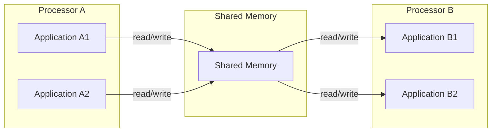
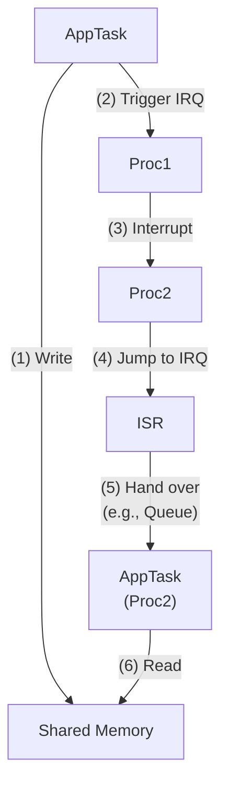
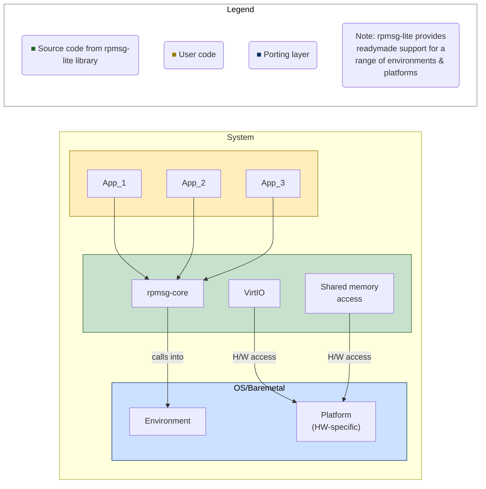
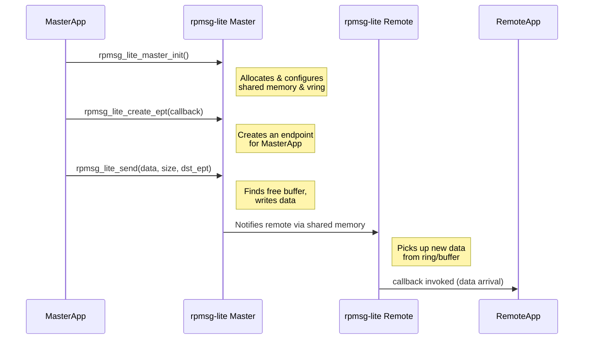
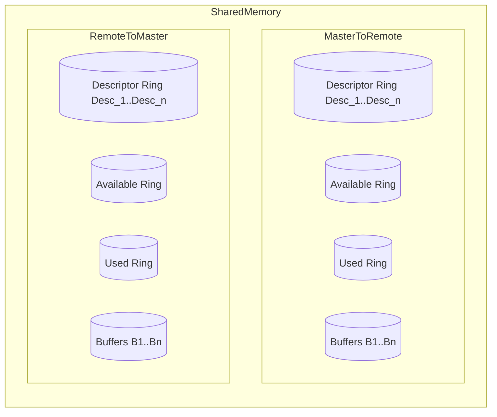

# RPMSG-Lite VirtIO Overview

- [RPMSG-Lite VirtIO Overview](#rpmsg-lite-virtio-overview)
  - [Introduction](#introduction)
  - [References](#references)
  - [Scope](#scope)
  - [Motivation](#motivation)
  - [Software Layers](#software-layers)
    - [5.1. rpmsg-core](#51-rpmsg-core)
      - [Terminology](#terminology)
    - [5.2. VirtIO](#52-virtio)
  - [Error Handling](#error-handling)

---

## Introduction

This document describes **rpmsg-lite** software library and its internal components used for communication between applications residing on heterogeneous computing units which are interconnected over a shared memory hardware interface. It can be roughly thought of as an IPC mechanism where the ‘P’ stands for Processor instead of a Process in the IPC mechanisms offered by operating systems.

`rpmsg-lite` is a “C” library that is modularized such that it can be used in various settings like bare-metal, general-purpose, and real-time operating systems.

---

## References

1. [https://github.com/nxp-mcuxpresso/rpmsg-lite](https://github.com/nxp-mcuxpresso/rpmsg-lite)  
2. [Introduction to VirtIO (Oracle Blog)](https://blogs.oracle.com/linux/post/introduction-to-virtio)

---

## Scope

While `rpmsg-lite` provides a lot of capabilities—like zero-copy operations, different options to receive messages—this document does not attempt to describe all of them. It serves as an overview of the library and describes the **core data structures** and **functions** that underpin the features the library offers. It can be considered a supplement to the `README` file (which has more exhaustive coverage of all features).

---

## Motivation

A common model by which two applications on two different processors can communicate is illustrated below:

There are several implementation challenges involved in this model:

1. **Synchronization** between Sender and Receiver such that message integrity is guaranteed. How can the Sender know if the Receiver has read the message, and can it send a subsequent message without using an explicit locking mechanism?

2. **Orchestration** between multiple application tasks that need to use the same shared memory. How do we partition the shared memory so that applications can independently communicate with a peer application on the other end?

3. **Portability**: How can the application be designed such that it can be easily ported to another hardware platform or a different OS on the same hardware platform?

`rpmsg-lite` provides software abstractions that enable “send/receive” messages to peer applications. The library internally handles the communication-related challenges listed above.

---

## Software Layers

The following diagram illustrates the layering of software components:

- **Environment**: Defines abstractions for actions like memory allocation and mutual exclusion. It is driven mainly by the operating system used (or a bare-metal setup if no OS is used).
- **Platform**: Defines hardware-specific operations like memory address translations, interrupt handling, etc.
- **rpmsg-lite**: Combines the environment and platform layers to offer a unified IPC API.

The library supports certain combinations of environment and platform out-of-the-box. If a new environment (like a new OS) or a new hardware platform (like a different SoC) is needed, that support must be implemented and bundled along with `rpmsg-lite`.

`App_1` and `App_2` denote distinct applications using the same underlying `rpmsg-lite` instance to communicate with peer applications in the remote processor. In this diagram, these represent logical functionalities achieved via rpmsg communication, rather than separate OS processes. All apps and the rpmsg-lite code can be thought of as belonging to one “OS process,” with `rpmsg-core` multiplexing requests from each application on one processor and demultiplexing them on the remote processor.

The rpmsg-lite library does **not** create any threads/tasks internally. All actions are driven by the threads/tasks of user applications or an Interrupt Service Routine (ISR).

### 5.1. rpmsg-core

`rpmsg-core` encapsulates the APIs provided by `rpmsg-lite` to the applications. The main APIs are:

1. `rpmsg_lite_master_init()` or `rpmsg_lite_remote_init()`
2. `rpmsg_lite_create_ept()`
3. `rpmsg_lite_send()`

**Note**: There is no separate API for “recv.” When a message arrives for an endpoint, `rpmsg-lite` invokes a callback function provided by the application at endpoint creation. Typically, the callback runs in ISR context. The library also supports other receive mechanisms like blocking calls with a queue, but those are not described here.

#### Terminology

- **Link or Channel**: `rpmsg_lite_xxx_init()` functions create an `rpmsg_lite_instance` object, which denotes one end of a link.  
- **Master/Remote**:  
  - The distinction arises from using **VirtIO** to manage sharing memory among multiple endpoints.  
  - Other than the setup steps, there is no functional difference regarding sending or receiving. A “Remote” can send to the Master just as the Master can send to the Remote.  
- **Endpoint**: A `uint32` number representing a specific instance that uses the link for communication. Multiple endpoints can exist on a given link. When sending a message, the destination endpoint must be specified. Upon receiving the message, `rpmsg-lite` decodes the endpoint to invoke the corresponding callback.

Below is a typical flow of events:

### 5.2. VirtIO

VirtIO is used as the “media access layer” by the rpmsg library. The shared memory for the link/channel can be shared by multiple endpoints. VirtIO enables this lockless sharing mechanism. It is adapted from the VirtIO framework used in virtualization environments (see [Reference 2](https://blogs.oracle.com/linux/post/introduction-to-virtio)).

The shared memory used between a “master” and “remote” `rpmsg_lite_instance` is structured into a set of circular buffers enabling lockless communication:

There are two directions between a “master” and “remote”: **“master tx to remote rx”** and **“remote tx to master rx.”** Each direction has one VRING plus a set of buffers. The VRING is a region in shared memory where the VirtIO layer tracks buffer availability and usage.

- This partitioning of memory is done by the “master” instance.
- The remote can read the shared memory area, but cannot start sending until the master sets up the descriptors and “avail” areas in the VRING.
- `rpmsg_lite_master_init()` is provided with the start address of the shared memory and a set of C macros defining the partition:
  - `RL_BUFFER_PAYLOAD_SIZE`: Size of one buffer (max single-message size).
  - `RL_BUFFER_COUNT`: Number of buffers.
  - `VRING_SIZE`: Overhead area allocated to store/manage descriptors, available ring, and used ring.

VirtIO provides **two main abstractions**:

1. **vring**  
   - Defined by `struct vring` in `lib/include/virtio_ring.h` (rpmsg-lite repo).  
   - Contains three circular buffers:  
     1. **Descriptor Ring** – references `Desc_1 ... Desc_n`  
     2. **Available Ring** – `avail_xxx` data section  
     3. **Used Ring** – `used_xxx` data section  
   - By convention, the “master” can only write to the Descriptor and Available sections, while the “remote” writes to the Used section.

2. **virtqueue**  
   - Defined by `struct virtqueue` in `lib/include/virtqueue.h`.  
   - Contains a `struct vring` plus helper methods.  
   - An `rpmsg_lite_instance` creates two virtqueues: one for Tx and one for Rx.

**Note**: The `struct vring` and `struct virtqueue` objects reside in the main memory of each processor. They contain pointers to the actual VRING areas in shared memory. The master’s Tx queue and the remote’s Rx queue point to the same shared VRING (and vice versa for the opposite direction).

---

## Error Handling

Once the master sets up the descriptors as part of initialization, it remains unchanged while the `rpmsg_lite_instance` is alive. Communication can fail in certain circumstances:

1. If `rpmsg_lite_send()` is called with data larger than `RL_BUFFER_PAYLOAD_SIZE`, the method returns `RL_ERR_BUFF_SIZE`.
2. If `rpmsg_lite_send()` is called with data within the buffer size but no free buffers remain (e.g., the remote processor is busy and hasn’t released used buffers), the method returns `RL_ERR_NO_MEM`.

**Note**: A successful return of `rpmsg_lite_send()` only guarantees that the message is transferred to the shared buffer and that the remote processor is notified. It does **not** guarantee the remote has processed or freed the buffer. An application-level acknowledgement must be used if needed.
